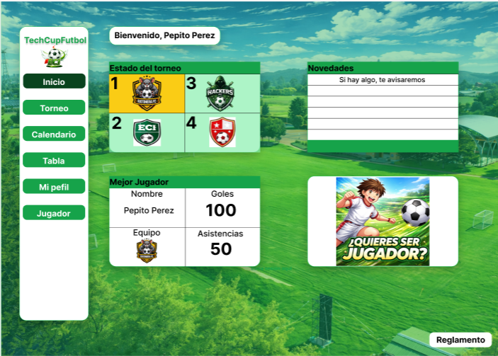
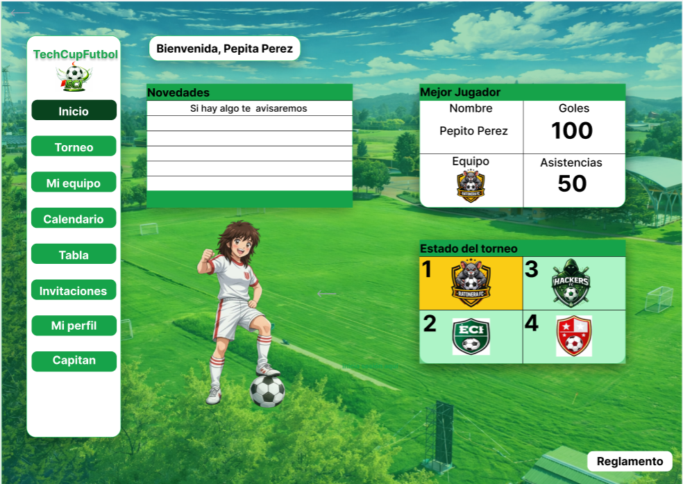
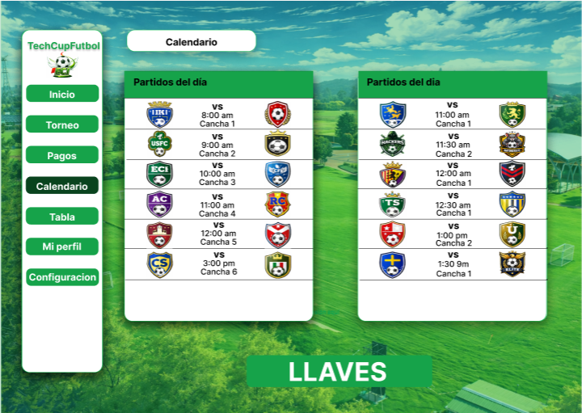
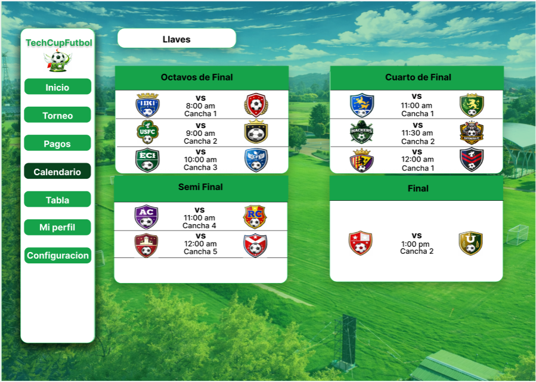
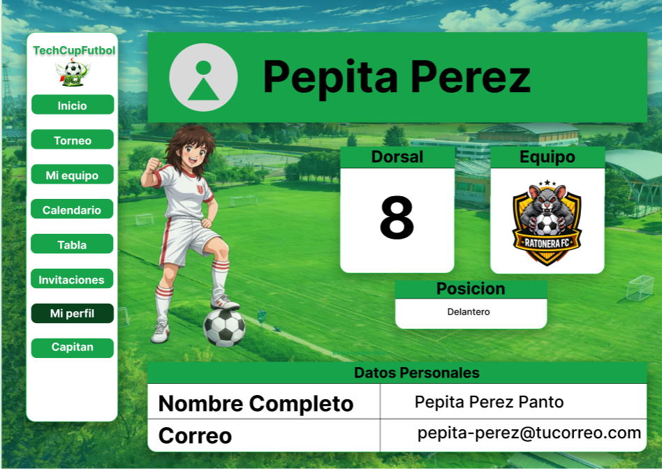
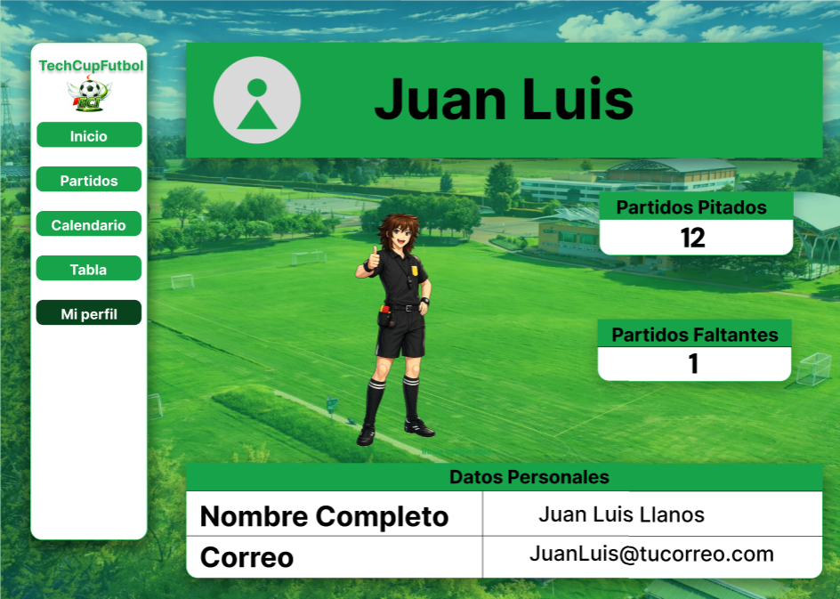
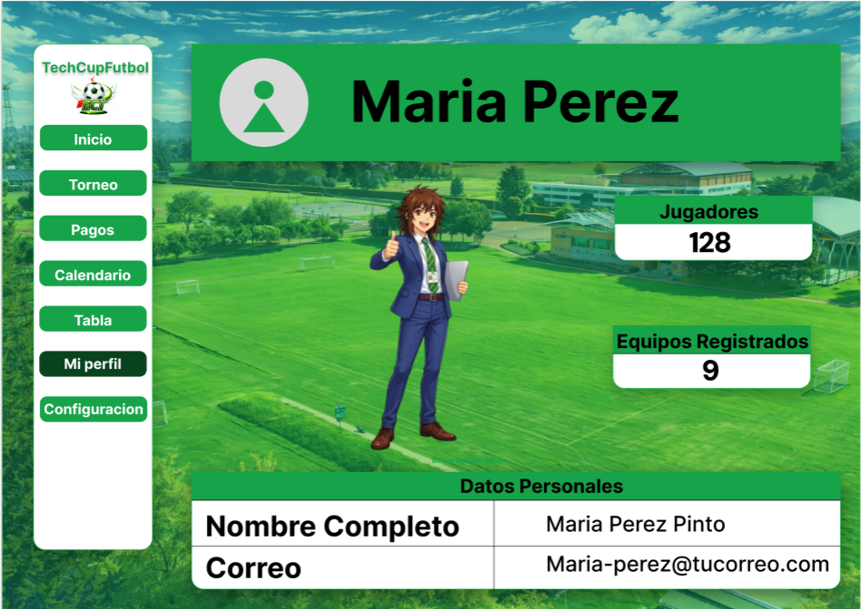
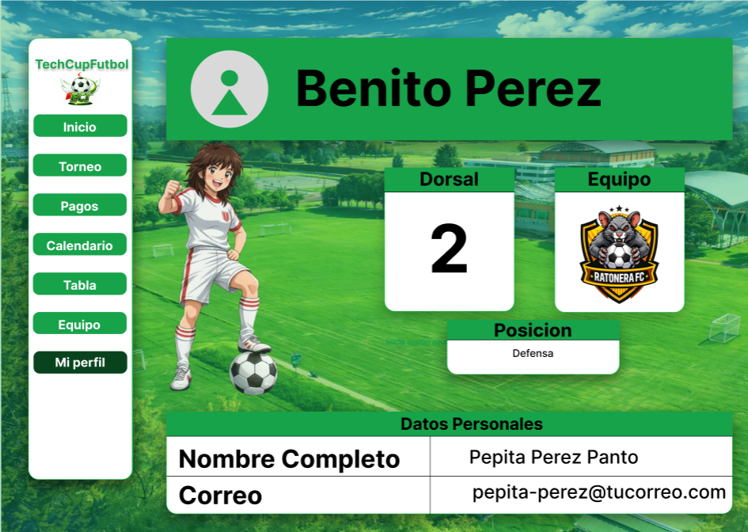

# TechCup Frontend

Repositorio independiente del **frontend** del proyecto TechCup.  
Base inicial construida con **React + Vite** para el Sprint 1.

---

## Participantes del proyecto

**Líder**
- Tomas Espitia — Líder de proyecto

**Backend**
- Diego Rozo — Backend
- Camilo Melo — Backend

**Frontend**
- Samuel Gil — Frontend
- Daniel Rodríguez — Frontend

---

## Contexto del proyecto

Actualmente, el torneo de fútbol de los programas de Ingeniería de la Escuela Colombiana de Ingeniería
carece de una plataforma centralizada, dependiendo de procesos manuales como mensajes de WhatsApp y hojas
de cálculo. Esta informalidad genera desorden en las inscripciones, retrasos en la verificación de
pagos, falta de claridad en las reglas y resultados dispersos. El problema radica en la ausencia de
una herramienta tecnológica que automatice la gestión administrativa y deportiva, afectando la experiencia
de estudiantes, graduados y organizadores.


**Alcance del Sprint4**
- Como sprint 4 tenemos que dejar finalizado todo el mockup 
---

## Logotipo


---

## Manual de identidad visual

Revisar: [Manual de identidad](docs/manualDeIdentidad.md)


## Mockups del sistema (Figma)

- Link de Figma: https://www.figma.com/design/yDz40hHbsyfoI0RDdJazoO/TECHCUP-V2?node-id=0-1&t=AZr7iCm8u15JhOa2-1


---

## Módulos del sistema (Web)

> Agrega imágenes en `docs/mockups/` (pueden ser capturas del Figma) y enlázalas aquí.

### 1) Módulo: Autenticación
**Descripción:** Inicio de sesión/registro y control de acceso a funcionalidades del sistema.


### 2) Módulo: Dashboard / Inicio
**Descripción:** Vista principal con resumen de información relevante del usuario y accesos rápidos.



---

### 3) Módulo: Gestión principal (Tablas / Equipos / Llaves )




---

### 4) Módulo: Perfil 






---


## Instalación y ejecución (dev)

> Requisitos: Node.js Como minimo para funcionamiento

```bash
cd techcupfrontend
npm install
npm run dev
```

---

## Scripts

```bash
npm run dev      # entorno local
npm run build    # build de producción
npm run preview  # previsualizar build
```