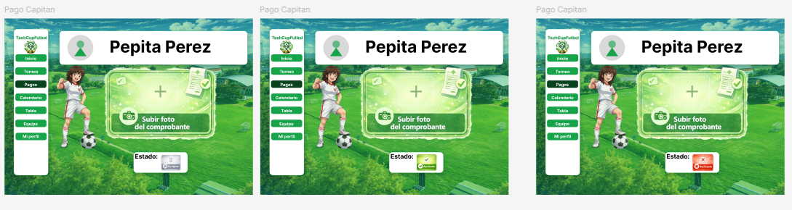
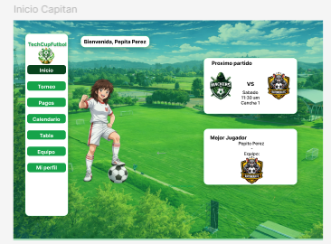
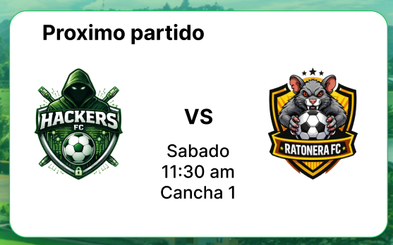

# Manual de Identidad Visual — TechCup Fútbol

> **"Tu próximo sprint empieza en la cancha."**

---

## Índice

1. [Nombre y Slogan](#1-nombre-y-slogan)
2. [Público Objetivo](#2-público-objetivo)
3. [Paleta de Colores](#3-paleta-de-colores)
4. [Tipografía](#4-tipografía)
5. [Principios de Diseño](#5-principios-de-diseño)
6. [Elementos Visuales y Fondo](#6-elementos-visuales-y-fondo)
7. [Componentes UI](#7-componentes-ui)
8. [Concepto Creativo](#8-concepto-creativo)
9. [Reglas de Negocio Visuales](#9-reglas-de-negocio-visuales)

---

## 1. Nombre y Slogan

**Nombre oficial:** TechCup Fútbol
**Slogan:** *"Tu próximo sprint empieza en la cancha."*

El nombre fusiona el universo tecnológico de los programas de ingeniería con la práctica deportiva del fútbol universitario. El slogan hace referencia directa al concepto de *sprint* — iteración de trabajo en metodologías ágiles — recontextualizándolo en el espacio físico de la cancha, estableciendo así un puente semántico entre el desarrollo de software y el deporte.

---

## 2. Público Objetivo

### Público Primario

| Atributo | Descripción |
|----------|-------------|
| **Programas** | Ingeniería de Sistemas, Inteligencia Artificial, Ciberseguridad, Estadística |
| **Edad** | 18 – 28 años |
| **Perfil** | Estudiantes universitarios activos |
| **Nivel tecnológico** | Medio – Alto |
| **Rol en la plataforma** | Jugador o Capitán de equipo |

Los estudiantes de ingeniería son los principales participantes del torneo semestral y quienes interactúan con mayor frecuencia con la plataforma: se registran, crean o se unen a equipos, gestionan alineaciones y realizan el pago de su inscripción subiendo el comprobante correspondiente.

### Público Secundario

| Atributo | Descripción |
|----------|-------------|
| **Personas** | Graduados, profesores, personal administrativo, árbitros, organizadores |
| **Edad** | 22 – 50 años |
| **Nivel tecnológico** | Medio |
| **Rol en la plataforma** | Árbitro, organizador o administrador |

---

## 3. Paleta de Colores

La paleta de TechCup Fútbol está construida sobre tres ejes cromáticos: **verde**, **blanco** y **negro**. Esta elección no es arbitraria: responde a criterios de identidad institucional, accesibilidad visual y coherencia semántica con el contexto universitario y deportivo de la plataforma.

### ¿Por qué verde, blanco y negro?

El **verde** es el color principal del torneo por dos razones fundamentales. La primera es su vínculo directo con la **Ingeniería de Sistemas**, programa académico que lidera el desarrollo de esta plataforma web. Si bien el torneo involucra otros programas de ingeniería, ninguno de ellos tiene una derivación cromática tan clara hacia el verde como Sistemas, lo que lo convierte en el color más representativo del proyecto. La segunda razón es su asociación natural con el **fútbol**: el verde evoca el campo de juego, el césped, el espacio de competencia. Esta doble lectura — tecnología + deporte — consolida el verde como el color rector de toda la identidad visual.

El **blanco** garantiza legibilidad, limpieza visual y contraste funcional. Es el color de las tarjetas, el sidebar y los fondos de los componentes de interfaz, lo que permite que el contenido (nombres de usuarios, partidos, estado de pagos) se lea sin esfuerzo sobre cualquier superficie.

El **negro** se reserva principalmente para texto, asegurando la máxima relación de contraste posible sobre fondos blancos y logrando así el cumplimiento de los estándares de accesibilidad.

---

### Tabla de colores

| Nombre | Hex | Uso principal |
|-|-----|---------------|
| Verde Principal | `#16A34A` | Color primario — botones activos, navegación seleccionada, elementos de acción |
| Verde Oscuro | `#09431E` | Verde de énfasis — resalta elementos seleccionados dentro del sidebar y estados destacados |
 | Verde Éxito | `#22C55E` | Estado aprobado — comprobante de pago aceptado por el organizador |
| Rojo Fracaso | `#DC2626` | Estado rechazado — comprobante de pago denegado por el organizador |
| Blanco | `#FFFFFF` | Fondo de tarjetas, sidebar, componentes UI |
| Negro / Texto | `#111827` | Texto principal, nombres, etiquetas, datos del usuario |

---

### Verde Principal — `#16A34A`

Este verde de tono medio-brillante es el **color de acción** de la interfaz. Aparece en:

- El fondo de los ítems de navegación activos en el sidebar.
- Los botones de navegación del menú lateral (Inicio, Torneo, Pagos, Calendario, Tabla, Equipo, Mi Perfil).
- Las marcas y contornos de elementos interactivos.

Su saturación moderada permite que los botones sean claramente identificables sin generar fatiga visual, incluso sobre el fondo fotográfico del campo universitario.

---

### Verde Oscuro — `#09431E`

Este verde profundo se utiliza para **contrastar y enfocar** elementos dentro de la navegación. Aparece como fondo del ítem activo dentro del sidebar (el estado "seleccionado" de la sección actual), diferenciándolo visualmente del resto de las opciones disponibles. Su oscuridad genera una jerarquía clara: el usuario siempre sabe en qué sección se encuentra.

---

### Verde Éxito y Rojo Fracaso

Estos dos colores forman el sistema de **retroalimentación visual** para el flujo de pagos. Cuando un capitán de equipo sube el comprobante de inscripción, el organizador puede aprobar o rechazar dicho comprobante. El resultado se refleja en la vista de **Pago Capitán** mediante:

- Un **badge verde** (con ícono de aprobación) cuando el comprobante ha sido aceptado.
- Un **badge rojo** (con ícono de rechazo) cuando el comprobante ha sido denegado.

Este sistema binario de retroalimentación es intuitivo porque sigue la convención universal semafórica: verde = correcto, rojo = error.

---

## 4. Tipografía

### Fuente principal: Inter

**Inter** es la tipografía seleccionada para todos los textos de la interfaz, incluyendo etiquetas, botones, nombres de usuario, metadatos y párrafos informativos.

#### ¿Por qué Inter?

Inter es una tipografía de código abierto diseñada específicamente para **interfaces de usuario digitales**. Sus características técnicas la hacen ideal para este proyecto:

1. **Optimizada para pantallas:** Inter fue diseñada con métricas cuidadosamente calibradas para lograr la máxima legibilidad en resoluciones de pantalla bajas y altas, lo que la hace funcional tanto en monitores de escritorio como en dispositivos móviles.

2. **Legibilidad a tamaños pequeños:** Sus formas abiertas, el alto x-height (altura de la letra minúscula) y la distinción clara entre caracteres similares (como `l`, `I` y `1`) garantizan que incluso los metadatos más pequeños de la interfaz — horario del partido, número de cancha, estado del equipo — sean perfectamente legibles.

3. **Amplia familia tipográfica:** Inter ofrece múltiples pesos (Light, Regular, Medium, SemiBold, Bold) que permiten establecer una jerarquía visual sólida sin necesidad de cambiar de fuente. Esto simplifica la implementación y mantiene la coherencia visual en toda la plataforma.

4. **Neutralidad contextual:** Al no tener personalidad estilística excesiva, Inter no compite visualmente con los demás elementos de la interfaz (logotipos de equipos, fondo fotográfico, badges de estado). Simplemente comunica la información de forma directa y eficiente.

5. **Disponibilidad gratuita:** Al ser de código abierto y estar disponible en Google Fonts, su integración en el repositorio del proyecto no implica costos de licencia.

---

### Escala tipográfica

| Nivel | Tamaño | Peso | Uso |
|-------|--------|------|-----|
| **Título de usuario** | 28px – 32px | Bold (700) | Nombre del capitán / jugador en la cabecera de perfil |
| **Título de sección** | 18px | SemiBold (600) | Encabezados de tarjeta ("Próximo partido", "Mejor Jugador") |
| **Texto principal** | 14px | Regular (400) | Contenido de tarjetas, datos de partidos, nombres de equipos |
| **Etiquetas** | 12px | Medium (500) | Ítems del sidebar, labels de campos |
| **Metadatos** | 11px – 12px | Regular (400) | Hora, cancha, fecha, información auxiliar |

---

## 5. Principios de Diseño

### Equilibrio

La interfaz organiza la información en una estructura de **dos zonas principales**: el sidebar de navegación a la izquierda y el área de contenido a la derecha. Esta distribución asimétrica pero equilibrada garantiza que la navegación esté siempre disponible sin ocupar el espacio central, que queda reservado para el contenido relevante del usuario (próximo partido, mejor jugador, formulario de pago).

### Contraste

El uso de texto negro (`#111827`) sobre fondos blancos en las tarjetas asegura una relación de contraste superior a 7:1, cumpliendo con los estándares **WCAG AAA**. Por su parte, el texto blanco sobre los botones verdes del sidebar mantiene una relación de contraste funcional que permite leer con claridad las opciones de navegación incluso sobre el fondo fotográfico del campo.

### Jerarquía

Los elementos visuales siguen un orden de lectura deliberado:

1. El **saludo personalizado** ("Bienvenida, Pepita Perez") orienta al usuario sobre su identidad en la plataforma.
2. Las **tarjetas de información** (Próximo partido, Mejor Jugador) presentan los datos más relevantes en el área central.
3. El **sidebar** actúa como sistema de orientación global, siempre visible y jerarquizado por ítem activo.

### Coherencia

Todos los componentes (tarjetas, botones, badges de estado) siguen las mismas reglas de forma: bordes redondeados, fondos blancos, texto oscuro, acentos en verde. Esta coherencia reduce la carga cognitiva del usuario al interactuar con diferentes secciones de la plataforma.

---

## 6. Elementos Visuales y Fondo

### Fondo: El campo universitario

Uno de los elementos visuales más distintivos de TechCup Fútbol es el uso de una **fotografía real de las canchas de fútbol de la Escuela Colombiana de Ingeniería Julio Garavito** como fondo de la interfaz. Esta decisión responde a los siguientes criterios:

**Identidad institucional:** Al utilizar imágenes de las instalaciones deportivas propias de la universidad, la plataforma refuerza su pertenencia y su vínculo con la comunidad ECI. El torneo es un evento interno de la institución, y el fondo lo refleja con autenticidad.

**Inmersión contextual:** Ver el campo real donde se disputarán los partidos crea una experiencia visual que conecta emocionalmente al usuario con el torneo. No es un campo genérico: es *su* cancha.

**Regla de uso:** Como parte de las reglas de negocio del proyecto, **se deben utilizar únicamente imágenes fotográficas de las instalaciones de la Escuela Colombiana de Ingeniería Julio Garavito** para el fondo de la interfaz. No se permite el uso de imágenes de stock, ilustraciones genéricas ni fotografías de otras instituciones. Esta regla garantiza la autenticidad institucional de la plataforma.

---

### Personaje ilustrado

La interfaz incorpora un **personaje ilustrado en estilo anime** posicionado sobre el fondo fotográfico del campo. Este personaje actúa como un elemento de identidad visual que humaniza la plataforma y le aporta personalidad, diferenciándola de una aplicación de gestión deportiva convencional.

El personaje viste el uniforme de fútbol blanco con detalles en verde, manteniendo coherencia con la paleta de colores de la plataforma.

---

### Logotipos de equipos

Cada equipo registrado en el torneo tiene su propio **escudo o logotipo**, que aparece en las tarjetas de partidos, en el perfil del capitán y en las vistas de resultados. Los escudos se muestran dentro de contenedores circulares o cuadrados con borde redondeado, sobre fondo blanco.

---

## 7. Componentes UI

### Sidebar de navegación

El sidebar es el componente de navegación principal de la interfaz. Ocupa el lado izquierdo de la pantalla y se mantiene visible en todas las vistas.

**Estructura:**
- **Cabecera:** Logotipo de TechCup Fútbol con ícono circular en verde.
- **Ítems de navegación:** Inicio, Torneo, Pagos, Calendario, Tabla, Equipo, Mi Perfil.
- **Estado activo:** El ítem correspondiente a la sección actual se distingue con fondo en **Verde Oscuro (`#09431E`)** sobre el fondo verde del sidebar.

**Colores:**
- Fondo del sidebar: blanco (`#FFFFFF`)
- Botones de navegación: Verde Principal (`#16A34A`) con texto blanco
- Ítem activo: Verde Oscuro (`#09431E`)

---

### Tarjetas de información

Las tarjetas son los contenedores de información del área principal. Tienen fondo blanco, bordes redondeados y una sombra sutil que las eleva sobre el fondo fotográfico.

**Tipos de tarjeta utilizados:**

| Tarjeta | Contenido |
|---------|-----------|
| **Próximo partido** | Escudos de los dos equipos, separador "VS", fecha, hora y cancha |
| **Mejor jugador** | Nombre del jugador destacado, equipo y escudo del equipo |
| **Pago de inscripción** | Nombre del capitán, botón para subir comprobante y badge de estado |

---

### Sistema de estados de pago

El flujo de pago de inscripción es uno de los procesos más críticos de la plataforma. Un capitán sube el comprobante de pago y el organizador lo revisa. El estado resultante se comunica visualmente mediante un badge en la parte inferior de la vista:

| Estado | Color | Descripción |
|--------|-------|-------------|
| **Pendiente** | Gris neutro | El comprobante ha sido subido pero aún no ha sido revisado |
| **Aprobado** | Verde Éxito (`#22C55E` aprox.) | El organizador ha verificado y aprobado el pago |
| **Rechazado** | Rojo Fracaso (`#DC2626` aprox.) | El organizador ha rechazado el comprobante |

---

### Botones

| Variante | Fondo | Texto | Uso |
|----------|-------|-------|-----|
| **Primario** | `#16A34A` | Blanco | Acciones principales (navegar, confirmar) |
| **Subir archivo** | Borde verde punteado | Verde/Negro | Zona de carga del comprobante de pago |
| **Éxito (badge)** | `#22C55E` | Blanco | Estado aprobado |
| **Error (badge)** | `#DC2626` | Blanco | Estado rechazado |

---

## 8. Concepto Creativo

### "La cancha como interfaz"

TechCup Fútbol parte de una premisa conceptual clara: **el espacio del partido y el espacio digital son el mismo**. El campo universitario que aparece como fondo no es una decoración — es la cancha donde los mismos usuarios que navegan la plataforma disputarán sus partidos. Esta continuidad entre el mundo físico y el digital es el núcleo de la experiencia visual del proyecto.

### Pilares del concepto

**Institucional antes que genérico**
Cada elemento visual está anclado a la realidad de la Escuela Colombiana de Ingeniería: el campo es el campo de la ECI, los colores aluden a los programas de la institución, los equipos son conformados por sus propios estudiantes.

**Fútbol + Ingeniería**
El lenguaje visual combina elementos deportivos (escudos, marcadores, canchas) con la sobriedad funcional propia del diseño de software (tipografía Inter, tarjetas limpias, jerarquía clara de información).

**Cercano y competitivo**
El personaje ilustrado en estilo anime y el diseño de los escudos de equipo aportan personalidad y sentido de competencia. La plataforma no es solo una herramienta administrativa — es la cara visible de un torneo universitario con identidad propia.

---

## 9. Reglas de Negocio Visuales

Las siguientes reglas deben respetarse en toda iteración o actualización de la interfaz:

1. **Imágenes institucionales obligatorias:** El fondo de la plataforma debe ser siempre una fotografía de las instalaciones deportivas de la Escuela Colombiana de Ingeniería Julio Garavito. No se permite reemplazarla con imágenes de stock o de otras instituciones.

2. **Verde como color primario indiscutible:** El verde (`#16A34A` y `#09431E`) no puede ser reemplazado por otro color como primario. Su elección responde a la identidad del programa de Ingeniería de Sistemas y al contexto deportivo del torneo.

3. **Negro para texto:** Todo texto informativo sobre fondos blancos debe utilizar negro o gris muy oscuro (`#111827`). No se permite texto de colores sobre fondos blancos salvo en badges y estados.

4. **Retroalimentación binaria en pagos:** El sistema de estado de pago debe mantener siempre la dualidad verde (aprobado) / rojo (rechazado). No se deben introducir otros colores para estados adicionales sin validación previa del equipo de diseño.

5. **Inter como única tipografía de interfaz:** No se permite mezclar Inter con otras fuentes en los componentes de la interfaz. El uso de otras tipografías queda restringido a materiales externos de comunicación (afiches, redes sociales).

6. **Sidebar siempre visible:** El sidebar de navegación no debe ocultarse en la versión de escritorio. Es el elemento de orientación principal del usuario y su disponibilidad constante es parte de la experiencia de uso definida.

---

## Recursos

| Recurso | Enlace |
|---------|--------|
| Mockups Figma | [Ver en Figma](https://www.figma.com/design/yDz40hHbsyfoI0RDdJazoO/TECHCUP-V2?node-id=0-1&p=f&t=e6gDp7uyBkI3JcEt-0) |
