# Manual de Identidad Visual — TechCupFútbol

> Documento oficial de identidad visual de la plataforma TechCupFútbol.  
> Versión 1.0 — Sprint 3 — Los cuervos de Odin — Escuela Colombiana de Ingeniería Julio Garavito

---

## Tabla de Contenido

1. [Introducción y contexto de marca](#1-introducción-y-contexto-de-marca)
2. [Nombre oficial y slogan](#2-nombre-oficial-y-slogan)
3. [Público objetivo](#3-público-objetivo)
4. [Logo y variantes](#4-logo-y-variantes)
5. [Paleta de colores](#5-paleta-de-colores)
6. [Tipografía](#6-tipografía)
7. [Imágenes de fondo y estilo visual](#7-imágenes-de-fondo-y-estilo-visual)
8. [Componentes UI](#8-componentes-ui)
9. [Usos incorrectos](#9-usos-incorrectos)
10. [Galería de pantallas](#10-galería-de-pantallas)

---

## 1. Introducción y contexto de marca

**TechCupFútbol** es la plataforma digital oficial del torneo interno de fútbol de la Escuela Colombiana de Ingeniería Julio Garavito. Nació como proyecto académico dentro de la materia *Desarrollo de Software* (DOSW), con el objetivo de digitalizar y modernizar la gestión del torneo semestral que históricamente se ha organizado de forma manual.

La plataforma permite a estudiantes, graduados, profesores, administrativos, familiares y árbitros registrarse, formar equipos, enviar y recibir invitaciones, consultar resultados y seguir el torneo en tiempo real.

**¿Por qué necesitamos una identidad visual sólida?**  
Porque TechCupFútbol no es solo una herramienta funcional — es la cara digital de una tradición deportiva universitaria. Su identidad debe transmitir energía, competencia y pertenencia institucional, sin perder el espíritu técnico y juvenil de sus usuarios.

---

## 2. Nombre oficial y slogan

| Campo | Valor |
|---|---|
| **Nombre oficial** | TechCupFútbol |
| **Escritura correcta** | `TechCupFútbol` (sin espacio, con tilde en la ú) |
| **Abreviación permitida** | TechCup |
| **Slogan** | *"Tu próximo sprint empieza en la cancha."* |
| **Institución** | Escuela Colombiana de Ingeniería Julio Garavito |

### Justificación del nombre

- **Tech** → hace referencia directa al perfil tecnológico de sus participantes (estudiantes de ingeniería).
- **Cup** → evoca el concepto de copa o trofeo, símbolo universal de competencia deportiva.
- **Fútbol** → define el deporte, escrito en español para reforzar la identidad latinoamericana e institucional.

La unión de las tres palabras en una sola crea un nombre memorable, corto y fácil de pronunciar, que funciona tanto en contextos digitales como visuales.

---

## 3. Público objetivo

### Primario

| Campo | Descripción |
|---|---|
| **Quiénes son** | Estudiantes activos de los programas de ingeniería |
| **Programas** | Ingeniería de Sistemas, Inteligencia Artificial, Ciberseguridad, Estadística, Maestría en Gestión de Información |
| **Edad** | 18 – 28 años |
| **Nivel tecnológico** | Medio – alto |
| **Rol en la plataforma** | Jugador o Capitán de equipo |
| **Motivación** | Participar en el torneo, unirse a un equipo, competir |

### Secundario

| Campo | Descripción |
|---|---|
| **Quiénes son** | Graduados, profesores, administrativos, familiares, árbitros, organizadores |
| **Edad** | 22 – 50 años |
| **Nivel tecnológico** | Medio |
| **Rol en la plataforma** | Jugador ocasional, árbitro, organizador o administrador |
| **Motivación** | Apoyar, gestionar o arbitrar el torneo |

---

## 4. Logo y variantes

### Descripción del logo

El logo de TechCupFútbol fue diseñado con inteligencia artificial (ChatGPT / DALL-E) y representa visualmente la fusión entre el deporte universitario y la ingeniería tecnológica. Cada elemento fue elegido con una intención clara.


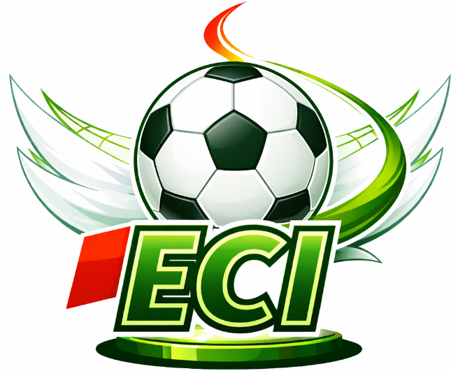


### Anatomía y justificación de cada elemento

| Elemento | Descripción | Significado |
|---|---|---|
| **Copa plateada con base dorada** | Copa clásica de trofeo con asas curvas, base dorada y estrellas | Representa la competencia, el logro y el espíritu de torneo. Es el elemento central que da nombre a la marca: la *Cup*. |
|  **Balón de fútbol** | Balón clásico blanco y negro en el centro del chip | Identifica directamente el deporte del torneo. Su posición central dentro del chip refuerza que el fútbol es el núcleo de la plataforma. |
|  **Chip tecnológico verde** | Placa de circuito integrado que rodea el balón | Simboliza la tecnología e ingeniería que rodea y hace posible el torneo. Representa a los estudiantes de ingeniería como protagonistas. |
|  **Estrella dorada en la cima** | Estrella brillante en la parte superior de la copa | Representa la excelencia, la meta y el primer lugar — el objetivo de todo equipo que participa en el torneo. |
|  **Laureles dorados en la base** | Ramas de laurel a ambos lados de la base de la copa | Símbolo clásico de victoria y reconocimiento académico-deportivo. Conecta la tradición universitaria con el logro competitivo. |
|  **Candado de seguridad** | Ícono de candado verde en la esquina superior derecha | Hace referencia a la **Ingeniería de Ciberseguridad** y al pilar de seguridad de la plataforma (autenticación, JWT, OAuth2). |
|  **Laptop verde** | Computador portátil en la esquina inferior derecha | Representa los **programas de ingeniería de sistemas e inteligencia artificial** y el entorno digital en el que vive la plataforma. |
|  **Engranaje** | Engranaje mecánico en la parte derecha | Simboliza la **ingeniería** en su sentido más amplio — la construcción, el proceso y la arquitectura técnica del sistema. |
|  **Gráfica de barras** | Barras de crecimiento en la parte izquierda | Representa las **estadísticas del torneo** — tabla de posiciones, goles, asistencias — y el análisis de datos como parte del perfil ingenieril. |
|  **Birrete universitario** | Birrete negro en la esquina superior izquierda | Referencia directa a la **Escuela Colombiana de Ingeniería Julio Garavito** y al contexto académico del torneo. |
|  **Ondas verdes dinámicas** | Trazos curvos verdes de fondo | Transmiten **energía, dinamismo y movimiento** — el espíritu deportivo activo que define a los participantes del torneo. |

### Síntesis del concepto

El logo de TechCupFútbol no es solo un trofeo — es un manifiesto visual de lo que somos: **ingenieros que juegan fútbol**. Cada ícono cuenta una parte de la historia: la academia, la tecnología, la seguridad, los datos y el deporte, unidos alrededor de un balón dentro de un chip, coronados por una estrella de excelencia.

El logo siempre aparece acompañado del nombre de la marca en tipografía **Inter ExtraBold**, en color **verde principal `#16A34A`** sobre fondos claros.

### Variantes de uso

| Variante | Uso recomendado | Fondo |
|---|---|---|
| Logo completo (ícono + texto) | Header principal, pantalla de inicio de sesión | Blanco o transparente |
| Solo ícono | Sidebar colapsado, favicon, notificaciones | Verde oscuro `#09431E` |
| Solo texto | Títulos secundarios, navegación lateral | Verde claro o blanco |

### Tamaños mínimos

| Contexto | Tamaño mínimo |
|---|---|
| Web desktop | 120px de ancho |
| Web móvil | 80px de ancho |
| Favicon | 32x32px |

### Espaciado

El logo debe tener siempre un margen de protección equivalente a la altura de la letra "T" del nombre alrededor de todos sus bordes. No se debe colocar ningún elemento dentro de esa zona de exclusión.

---

## 5. Paleta de colores

La paleta de TechCupFútbol está inspirada en los colores institucionales de la Escuela Colombiana de Ingeniería y en la estética visual de los campos de fútbol. Se compone de **5 colores principales** y **2 colores de estado**.

### Colores principales

| Rol | Nombre | Hex | RGB | Uso |
|---|---|---|---|---|
| 🟢 Primario | Verde principal | `#16A34A` | `22, 163, 74` | Botones primarios, nav activo, acentos |
| 🟩 Primario oscuro | Verde oscuro | `#09431E` | `9, 67, 30` | Ítem seleccionado en navegación, hover |
| 🟡  Énfasis  | Verde lima | `#C8F135` | `200, 241, 53` | Botón "Invitar", badges "Disponible" |
| 🟨 Destacado | Amarillo dorado | `#FACC15` | `250, 204, 21` | Posición 1 en tabla, destacados, trofeos |
| ⬛ Texto oscuro | Negro verdoso | `#1A2E1F` | `26, 46, 31` | Texto sobre fondos claros, labels |

### Colores de estado

| Estado | Nombre | Hex | Uso |
|---|---|---|---|
| 🔴 Error | Rojo error | `#FF0000` | Mensajes de error, validaciones fallidas, estado Rechazado |
| ⬜ Neutro | Blanco | `#FFFFFF` | Fondos de formularios, texto sobre verde oscuro |

---

## 6. Tipografía

TechCupFútbol usa un sistema tipográfico de **dos familias**: **Inter** para contenido general y navegación, y **DM Sans** para etiquetas, errores y elementos de interfaz de menor jerarquía.

### Familia principal: Inter

Inter es una tipografía de código abierto diseñada específicamente para pantallas digitales. Su alta legibilidad en tamaños pequeños y su carácter neutro pero moderno la hacen ideal para interfaces de datos y formularios extensos.

| Uso | Peso | Tamaño | Ejemplo |
|---|---|---|---|
| Título de página (`Registro Estudiante`) | ExtraBold | 64px | `Inter ExtraBold 64` |
| Subtítulo / descripción | Medium | 14px | `Inter Medium 14` |
| Navegación lateral (ítems) | Bold | 24px | `Inter Bold 24` |
| Texto de tabla | Bold | 14-16px | `Inter Bold 14` |
| Labels de formulario | Medium | 14px | `Inter Medium 14` |

### Familia secundaria: DM Sans

DM Sans es una tipografía geométrica de bajo contraste, diseñada para interfaces digitales modernas. Se usa en TechCupFútbol para elementos de menor jerarquía visual pero que requieren claridad y distinción del texto principal.

| Uso | Peso | Tamaño | Ejemplo |
|---|---|---|---|
| Labels de campos de formulario | SemiBold | 13px | `DM Sans SemiBold 13` |
| Mensajes de error (`*Campo Obligatorio*`) | SemiBold | 13px | `DM Sans SemiBold 13` |
| Badges de estado (`Disponible`, `En equipo`) | Bold | 11-13px | `DM Sans Bold 13` |
| Texto en botón "Invitar" | Bold | 13px | `DM Sans Bold 13` |


### Reglas de uso tipográfico

- **Nunca** mezclar más de dos familias tipográficas en una misma pantalla.
- Los títulos de pantalla siempre van en **verde primario `#16A34A`** sobre fondo blanco.
- Los mensajes de error siempre van en **rojo `#FF0000`** en **DM Sans SemiBold**.
- No se permite el uso de cursivas en la interfaz excepto en el slogan de la marca.

---

## 7. Imágenes de fondo y estilo visual

### Estilo general

TechCupFútbol usa un estilo visual inspirado en el **anime deportivo japonés**, particularmente en franquicias como *Captain Tsubasa*. Este estilo fue elegido deliberadamente para:

1. **Conectar con el público joven** (18–28 años) que es el usuario principal de la plataforma.
2. **Diferenciar visualmente** la plataforma de herramientas genéricas de gestión deportiva.
3. **Crear identidad emocional** — los usuarios recuerdan y se identifican con el estilo visual.
4. **Evocar el espíritu competitivo** del fútbol universitario de una forma dinámica y enérgica.

### Origen de las ilustraciones

Todas las ilustraciones de personajes y fondos fueron generadas con inteligencia artificial usando **ChatGPT (DALL-E)**, con prompts específicos que describen:
- Escenarios de campo de fútbol con estética anime
- Personajes con uniformes blancos con rayas rojas (inspirados en los colores de la ECI)
- Fondos con cielos azules, árboles y tribunas que evocan los campos deportivos de la Escuela

Las imágenes son originales generadas para este proyecto y no están sujetas a derechos de terceros.

### Características del estilo visual

| Elemento | Descripción |
|---|---|
| **Estilo artístico** | Anime deportivo — líneas limpias, colores vibrantes, expresiones dinámicas |
| **Paleta de fondo** | Verdes naturales, cielos azules claros, blancos luminosos |
| **Personajes** | Estudiantes jugadores en uniforme blanco con detalles rojos (ECI) |
| **Perspectiva** | Encuadres de campo desde ángulos dinámicos, abiertos y luminosos |
| **Mood** | Energético, optimista, competitivo, universitario |

### Uso de imágenes por pantalla

| Pantalla | Tipo de fondo | Descripción |
|---|---|---|
| Inicio de sesión | Campo de fútbol con personajes a los lados | Dos personajes flanquean el formulario de login |
| Selección de tipo de usuario | Campo abierto con cielo | Fondo limpio que no compite con las opciones de registro |
| Registro (formularios) | Campo con árboles y cielo | Fondo difuminado detrás de los formularios |
| Dashboard jugador | Campo con personaje de pie | Personaje jugador de pie con balón a la derecha del dashboard |
| Dashboard organizador | Campo con vista aérea | Vista más amplia del campo para el perfil de gestión |
| Pago capitán | Campo con personaje decorativo | Personaje en pose de celebración, enfoque en panel de carga |

### Reglas de uso de imágenes

- Las imágenes de fondo **nunca** deben competir visualmente con el contenido de formularios.
- Los formularios y paneles siempre van sobre **fondos blancos semitransparentes** para garantizar legibilidad.
- Los personajes deben ubicarse en zonas que **no interfieran con los elementos interactivos**.
- No usar imágenes de fondo en pantallas de error o modales de confirmación — usar fondo blanco limpio.

---

## 8. Componentes UI

### Botones

#### Botón primario (Continuar, Ingresar, Finalizar)

```
Fondo:      #16A34A (Verde primario)
Texto:      #FFFFFF (Blanco) — Inter Medium 14px
Border:     Sin borde
Radius:     8px
Padding:    12px 24px
Hover:      #09431E (Verde oscuro)
```

#### Botón deshabilitado (con errores activos)

```
Fondo:      #9CA3AF (Gris)
Texto:      #FFFFFF (Blanco) — Inter Medium 14px
Border:     Sin borde
Radius:     8px
Padding:    12px 24px
Cursor:     not-allowed
Opacidad:   0.7
```

**Uso:** Cuando el formulario tiene campos vacíos o con errores de validación, el botón "Continuar" cambia a gris para indicar visualmente que **no es posible avanzar**. Esto evita que el usuario intente enviar datos incompletos y evita peticiones innecesarias al servidor.

El botón vuelve al verde primario `#16A34A` automáticamente cuando todos los campos del paso están correctamente llenados.

```
Estado con errores:   Fondo #9CA3AF → no se puede continuar
Estado sin errores:   Fondo #16A34A → listo para continuar
```

#### Botón de acción destacada (Invitar)

```
Fondo:      #C8F135 (Verde lima)
Texto:      #1A2E1F (Negro verdoso) — DM Sans Bold 13px
Border:     Sin borde
Radius:     8px
Padding:    8px 16px
Hover:      #B8E126 (Verde lima oscuro)
```

**Uso:** Acciones que requieren atención inmediata como invitar jugadores o confirmar disponibilidad.

#### Botón secundario (Ver perfil, Ver )

```
Fondo:      Transparente
Texto:      #16A34A (Verde primario) — Inter Medium 14px
Border:     1px solid #16A34A
Radius:     8px
Hover:      Fondo #F0FDF4 (Verde muy claro)
```

**Uso:** Acciones secundarias o de navegación que no son el paso principal del flujo.

#### Botón de navegación (← Anterior, Siguiente →)

```
Estado deshabilitado:   Fondo #9CA3AF, Cursor not-allowed
Estado activo:          Fondo #16A34A, Texto #FFFFFF
Estado hover:           Fondo #09431E
```

---

### Campos de formulario

#### Estado normal

```
Fondo:       #F3F4F6 (Gris muy claro)
Borde:       1px solid #D1D5DB (Gris)
Placeholder: #9CA3AF — Inter Medium 14px
Texto:       #1A2E1F — Inter Medium 14px
Radius:      6px
Padding:     10px 14px
```

#### Estado de error

```
Borde:       2px solid #FF0000
Fondo:       #FFF (sin cambio)
Mensaje:     "*Campo Obligatorio*" — DM Sans SemiBold 13px — #FF0000
```

#### Estado completado / activo

```
Borde:       1px solid #16A34A
Fondo:       #F0FDF4 (Verde muy claro)
```


---

### Stepper de registro (Pasos 1 → 2 → 3)

```
Paso completado:   Círculo verde #16A34A con check ✓
Paso actual:       Círculo con borde verde #16A34A, número en negro
Paso pendiente:    Círculo gris #9CA3AF, número gris
Línea conectora:   Gris #D1D5DB entre pasos, Verde #16A34A en pasos completados
```

---

### Tabla de posiciones

```
Encabezado:         Fondo #16A34A, Texto #FFFFFF — Inter Bold
Posición 1:         Fondo #FACC15 (Amarillo dorado)
Posiciones 2-4:     Fondo #D1FAE5 (Verde muy claro)
Resto de filas:     Fondo #FFFFFF alternado con #F9FAFB
Borde entre filas:  1px solid #E5E7EB
```

---

### Badges de estado

Los badges indican el estado actual de un jugador, equipo o comprobante en el sistema.

#### Tipos de badge

| Badge | Color fondo | Color texto | Uso |
|---|---|---|---|
| **Aprobado** | `#16A34A` | `#FFFFFF` | Comprobante validado, perfil verificado |
| **Rechazado** | `#FF0000` | `#FFFFFF` | Comprobante no cumple, validación fallida |
| **En espera** | `#9CA3AF` | `#FFFFFF` | Pendiente de revisión u validación |
| **Disponible** | `#C8F135` | `#1A2E1F` | Jugador sin equipo, listo para invitar |
| **En equipo** | `#9CA3AF` | `#FFFFFF` | Jugador ya asignado a un equipo |

#### Especificación visual

```
Tipografía:     DM Sans Bold 13px
Border:         Sin borde
Radius:         20px (píldora)
Padding:        6px 12px
Alineación:     Centro
```

**Ejemplo de uso en tabla:**

```
Nombre        | Posición | Equipo        | Estado        | Acción
Carlos M.     | Del.     | Ratoneros FC  | En equipo     | Ver perfil
Laura J.      | Port.    | Sin equipo    | Disponible    | Invitar
Juan P.       | Def.     | Los cuervos   | En equipo     | Ver perfil
```

---

### Panel de carga de archivos

Se usa en pantallas donde el usuario debe subir un comprobante (pago, documento, foto).

```
Borde:      2px dashed #16A34A
Fondo:      #F0FDF4 (Verde muy claro)
Icono:      Cámara o documento — #16A34A
Texto:      "Subir foto del comprobante" — Inter Medium 14px — #1A2E1F
Radius:     12px
Padding:    20px
Hover:      Fondo #E0FDF0 (Verde más oscuro)
```

**Reglas:**
- Mostrar estado de carga si es necesario
- Cambiar icono a check verde cuando se sube correctamente
- Mostrar badge de estado debajo del panel (Aprobado / Rechazado / En espera)

---


---

## 9. Usos incorrectos

Los siguientes usos están **prohibidos** para mantener la coherencia de la identidad:

### Del logo

- Cambiar los colores del logo a colores fuera de la paleta oficial.
- Deformar o escalar el logo de forma no proporcional.
- Usar el logo sobre fondos que no contrasten suficientemente.
- Agregar sombras, contornos o efectos al logo.
- Separar el ícono del texto en contextos donde cabe el logo completo.

---

### De los colores

- Usar el rojo `#FF0000` fuera de contextos de error o estado rechazado.
- Usar el amarillo dorado `#FACC15` como color principal de botones.
- Usar el verde lima `#C8F135` en textos largos o párrafos.
- Combinar verde lima con verde primario en el mismo componente sin propósito claro.
- Usar más de 3 colores en un mismo componente.

---

### De la tipografía

- Usar fuentes distintas a Inter y DM Sans en la interfaz.
- Usar cursivas en botones, labels o navegación.
- Usar pesos menores a Medium (400) para texto de interfaz.
- Usar tamaños menores a 11px en cualquier texto visible.
- Mezclar más de dos familias tipográficas en la misma pantalla.

---

### De las imágenes

- Usar imágenes de fondo sin el panel blanco semitransparente sobre formularios.
- Colocar texto directamente sobre las ilustraciones de fondo sin contraste.
- Usar imágenes de personas reales mezcladas con las ilustraciones anime.
- Comprimir imágenes de fondo a calidades menores al 80%.
- Escalar personajes desproporcionadamente.

---

## 10. Galería de pantallas

### Pantalla de inicio de sesión

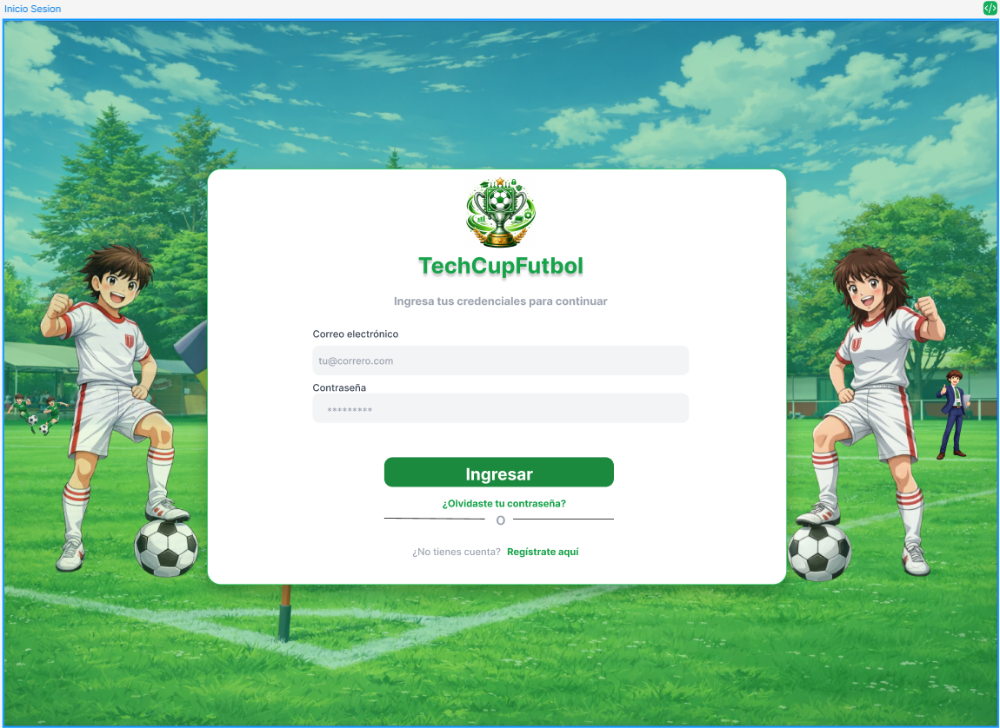

Pantalla principal de acceso a la plataforma. Muestra el logo, formulario de ingreso y personajes decorativos del lado izquierdo.

---

### Selección de tipo de usuario


Permite al usuario elegir qué tipo de perfil desea crear (Estudiante, Graduado, Profesor, etc.). Fondo de campo limpio sin competencia visual.

---

### Registro — Paso 1 (Datos personales)

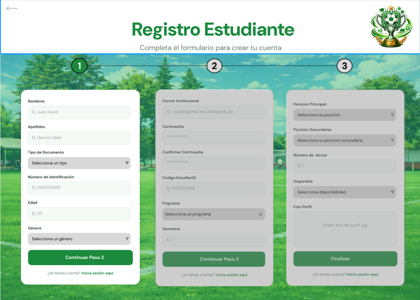

Primer paso del flujo de registro multi-paso. Recopila nombre, email y datos básicos. Stepper visible en la parte superior.

---

### Registro — Paso 2 (Datos institucionales)

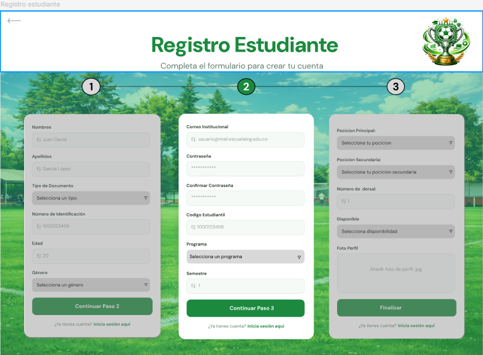

Segundo paso que valida datos institucionales, programa y semestre. Muestra validación de email institucional requerida.

---

### Registro — Paso 3 (Perfil deportivo)

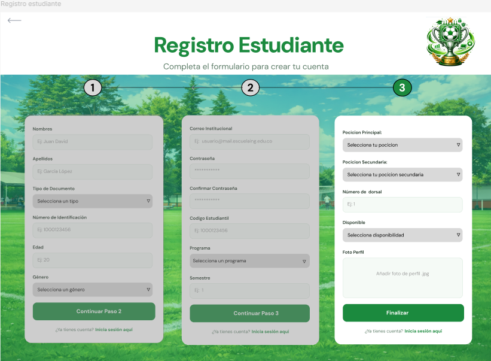

Tercer paso donde el usuario completa su perfil deportivo: posición, nivel de juego y disponibilidad para equipos.

---

### Dashboard jugador

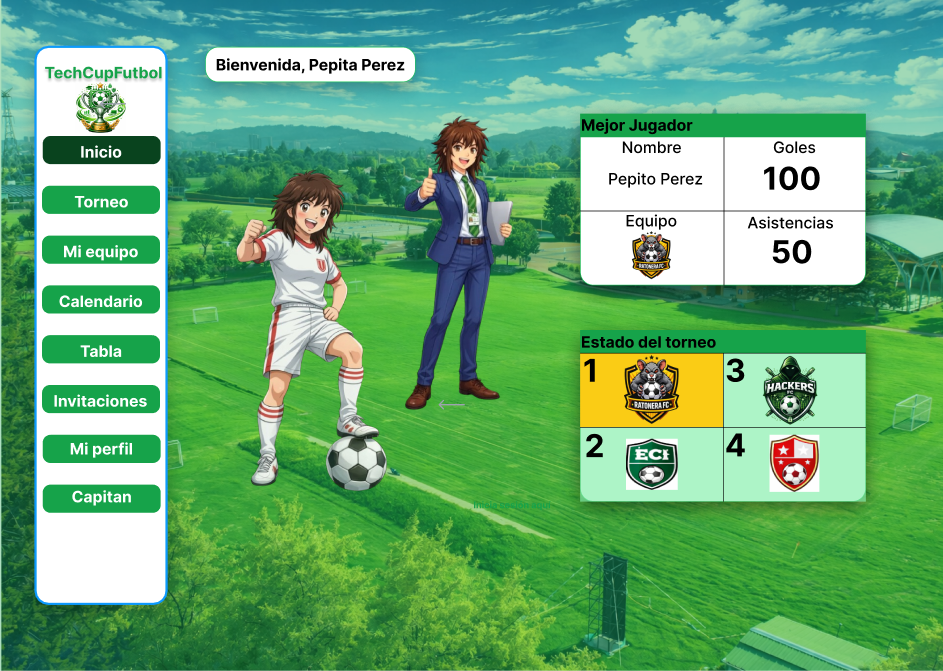

Panel principal del jugador. Muestra navegación lateral con opciones de Inicio, Torneo, Pagos, Calendario, Tabla, Equipo y Mi perfil. Personaje decorativo en la izquierda.

---

### Tabla de posiciones

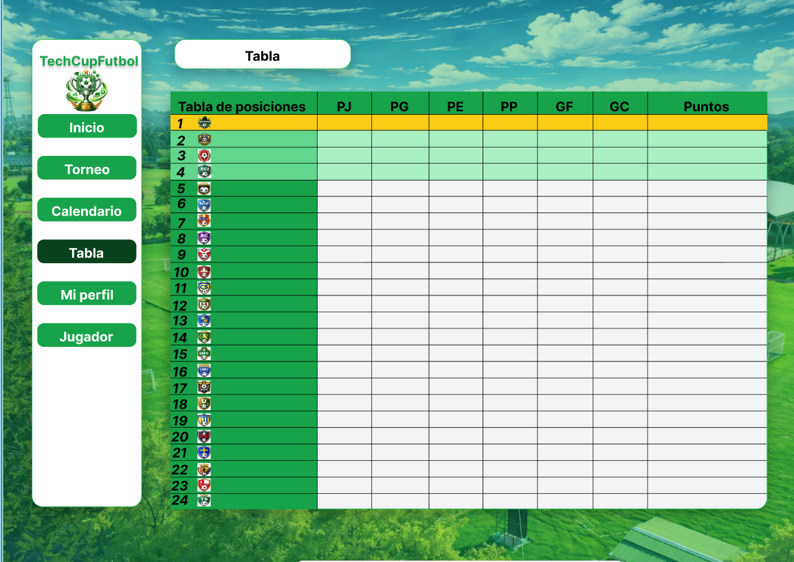

Tabla ranking general del torneo. Posición 1 destacada con fondo amarillo dorado. Filas alternadas. Permite ordenar por diferentes criterios.

---

### Pago Capitán

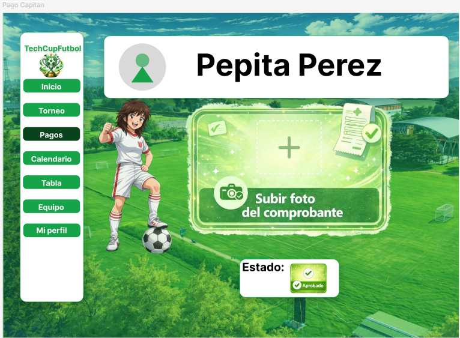
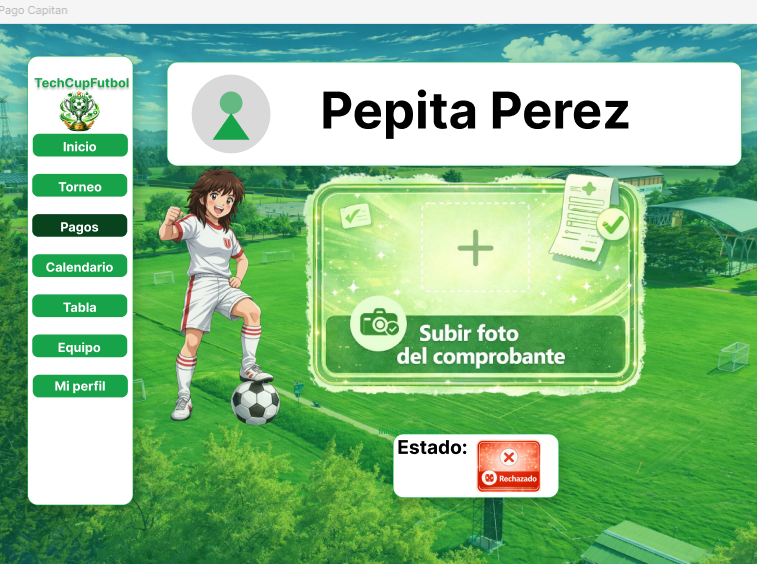

Panel específico para que el capitán del equipo suba el comprobante de pago de inscripción. Incluye:
- Nombre del capitán con avatar
- Panel de carga con borde dashed
- Icono de cámara y texto "Subir foto del comprobante"
- Badge de estado (En espera, Rechazado, Aprobado)

**Estados del comprobante:**
- **En espera** (`#9CA3AF`) — Ícono de reloj — El organizador aún no lo revisa
- **Rechazado** (`#FF0000`) — Ícono X rojo — No cumple requisitos, subir uno nuevo
- **Aprobado** (`#16A34A`) — Ícono check — Validado, inscripción completada

---

### Búsqueda de Jugadores — Capitán

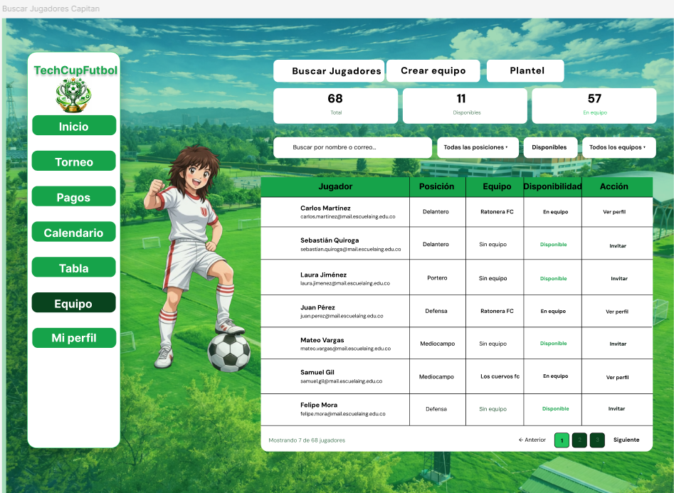

Pantalla que permite al capitán buscar e invitar jugadores disponibles.

**Componentes principales:**

1. **Barra de navegación interna:**
   - Tres fichas blancas: "Buscar Jugadores" (activa), "Crear equipo", "Plantel"
   - Colores: #FFFFFF fondo, #1A2E1F texto

2. **Tarjetas de resumen (Cards):**
   - **68 Total** — Jugadores registrados en el sistema
   - **11 Disponibles** — Jugadores sin equipo
   - **57 En equipo** — Jugadores ya asignados

3. **Búsqueda y filtros:**
   - Campo de búsqueda: "Buscar por nombre o correo..."
   - Botones de filtro: "Todas las posiciones •", "Disponibles", "Todos los equipos •"

4. **Tabla de jugadores:**
   - Columnas: Nombre, Posición, Equipo actual, Estado, Acción
   - Encabezado: Fondo `#16A34A`, texto blanco
   - Filas: Alternadas #FFFFFF y #F9FAFB
   - Badge Estado: Verde lima para "Disponible", gris para "En equipo"
   - Botón de acción: "Invitar" para disponibles, "Ver perfil" para en equipo

5. **Paginación (Pie de tabla):**
   - "Mostrando 7 de 68 jugadores"
   - Botones: ← Anterior | 1 (activo en verde) | 2 | 3 | Siguiente →

6. **Personaje decorativo:**
   - Jugador en pose ofensiva en la izquierda
   - Uniforme blanco con rayas rojas

---

### Estados de comprobante


Muestra los tres posibles estados del comprobante de pago:

| Estado | Apariencia | Significado |
|---|---|---|
| **En espera** | Badge gris `#9CA3AF` con ícono de reloj | Pendiente de revisión |
| **Rechazado** | Badge rojo `#FF0000` con X | No válido, resubir |
| **Aprobado** | Badge verde `#16A34A` con check ✓ | Aceptado |

Estos badges también aparecen en:
- Panel de perfil del jugador
- Tabla de búsqueda de jugadores
- Dashboard del organizador
- Historial de inscripciones

---

### Estados de error en formularios

Los errores en TechCupFútbol se manejan directamente en el frontend, **antes de enviar la petición al backend**, con el objetivo de reducir llamadas innecesarias al servidor y mejorar la experiencia del usuario.

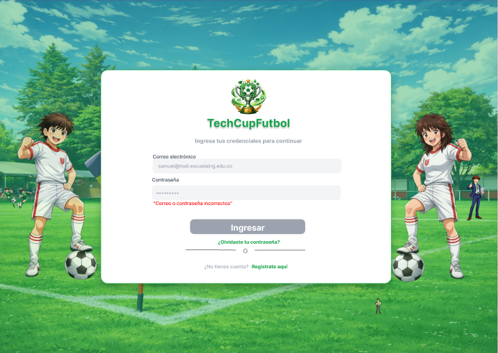

### Especificación visual del error

```
Color borde:    #FF0000 (Rojo)
Color fondo:    #FFFFFF (sin cambio)
Color mensaje:  #FF0000
Tipografía:     DM Sans SemiBold 13px
Posición:       Debajo del campo afectado
Prefijo:        *Campo Obligatorio* o mensaje específico
Ícono:          Opcional, en la izquierda del mensaje
```

**Ejemplos de mensajes:**
- `*Campo Obligatorio*` — El campo está vacío
- `*Formato de email inválido*` — El email no cumple el patrón
- `*Las contraseñas no coinciden*` — Campos de contraseña no son iguales
- `*Este email ya está registrado*` — Validación contra servidor

---


---

*Manual de Identidad Visual — TechCupFútbol v1.0*  
*Elaborado por el equipo Los cuervos de Odin — Escuela Colombiana de Ingeniería Julio Garavito*  
*DOSW — Sprint 3 — 2026*