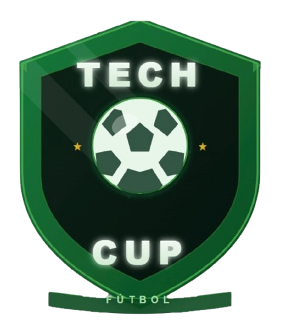
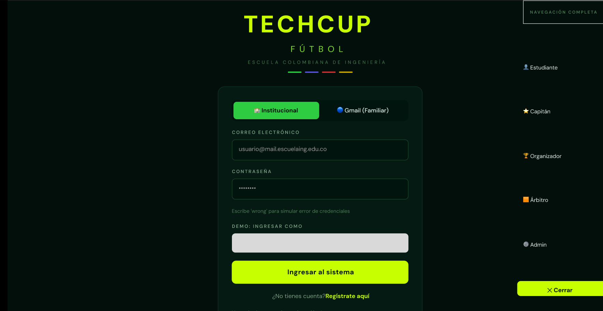
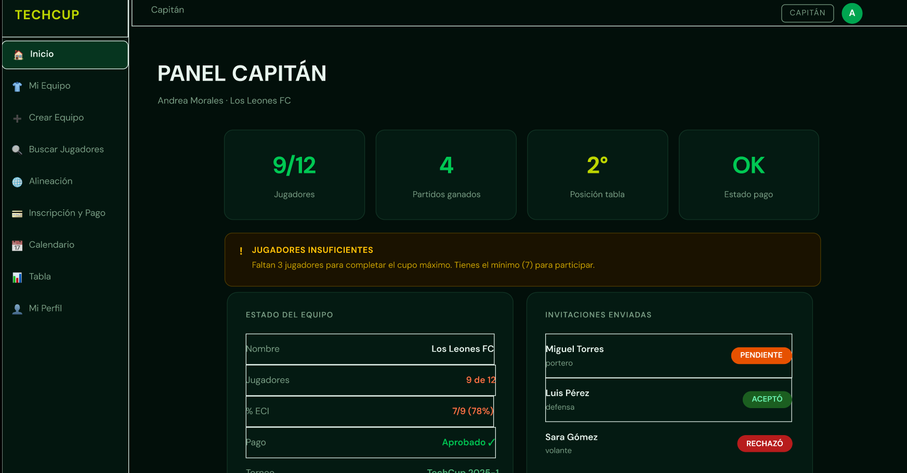
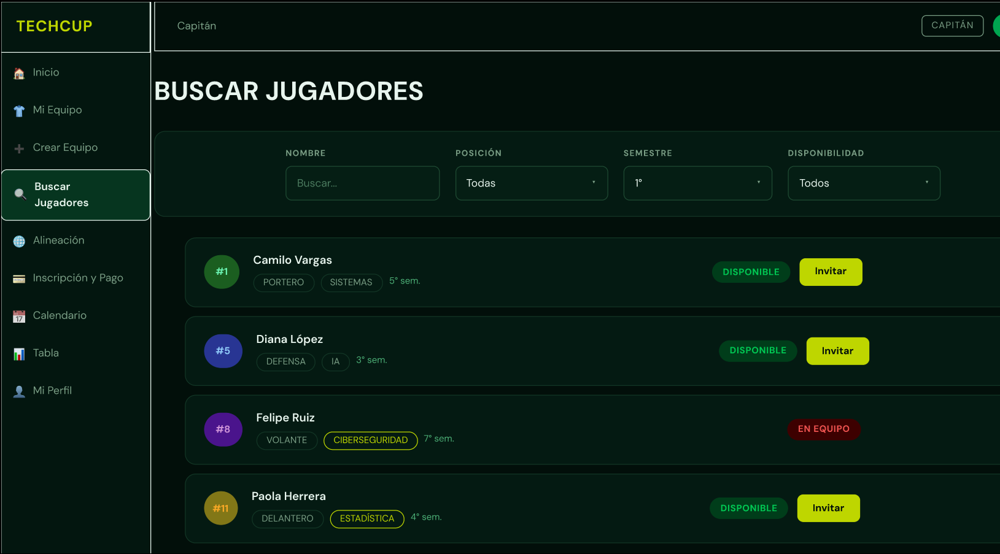
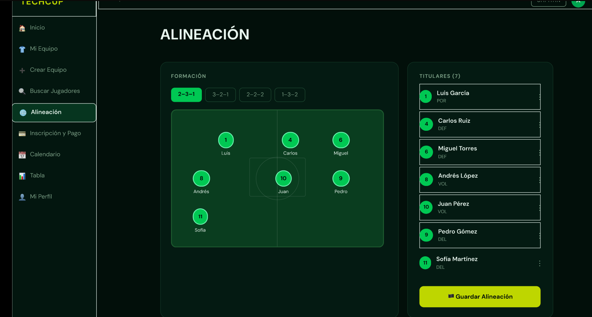
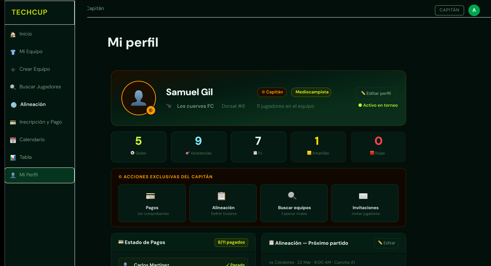

# TechCup Frontend

Repositorio independiente del **frontend** del proyecto TechCup.  
Base inicial construida con **React + Vite** para el Sprint 1.

---

## Participantes del proyecto

**Líder**
- Samuel Gil — Líder de proyecto

**Backend**
- Tomás Espitia — Backend
- Daniel Rodríguez — Backend

**Frontend**
- Diego Rozo — Frontend
- Camilo Melo — Frontend

---

## Contexto del proyecto

Actualmente, el torneo de fútbol de los programas de Ingeniería de la Escuela Colombiana de Ingeniería 
carece de una plataforma centralizada, dependiendo de procesos manuales como mensajes de WhatsApp y hojas
de cálculo. Esta informalidad genera desorden en las inscripciones, retrasos en la verificación de 
pagos, falta de claridad en las reglas y resultados dispersos. El problema radica en la ausencia de
una herramienta tecnológica que automatice la gestión administrativa y deportiva, afectando la experiencia
de estudiantes, graduados y organizadores.

En este Sprint 1 el objetivo principal es establecer la estructura inicial del frontend (no desarrollar la interfaz final), dejando una base en React lista para evolucionar en los siguientes sprints.

**Alcance del Sprint 1**
- Crear repositorio independiente del frontend.
- Inicializar aplicación base con React (Vite + React).
- Definir estructura inicial del proyecto.
- Documentar el producto (README, identidad visual, mockups y módulos).

---

## Logotipo



---

## Manual de identidad visual

Revisar: [Manual de identidad](docs/manualDeIdentidad.md)


## Mockups del sistema (Figma)

- Link de Figma: https://www.figma.com/design/jhj4eMbBLkSZvuz9xRVqxw/Sin-título?node-id=0-1&p=f&t=OojhDaGur8GIeEin-0


---

## Módulos del sistema (Web)

> Agrega imágenes en `docs/mockups/` (pueden ser capturas del Figma) y enlázalas aquí.

### 1) Módulo: Autenticación
**Descripción:** Inicio de sesión/registro y control de acceso a funcionalidades del sistema.



### 2) Módulo: Dashboard / Inicio
**Descripción:** Vista principal con resumen de información relevante del usuario y accesos rápidos.



---

### 3) Módulo: Gestión principal (ej. Torneos / Equipos / Usuarios) 
**Descripción:** CRUD o flujo principal del sistema (crear, listar, editar, eliminar).



---

### 4) Módulo: Perfil y configuración



---


## Instalación y ejecución (dev)

> Requisitos: Node.js Como minimo para funcionamiento

```bash
cd techcupfrontend
npm install
npm run dev
```

---

## Scripts 

```bash
npm run dev      # entorno local
npm run build    # build de producción
npm run preview  # previsualizar build
```