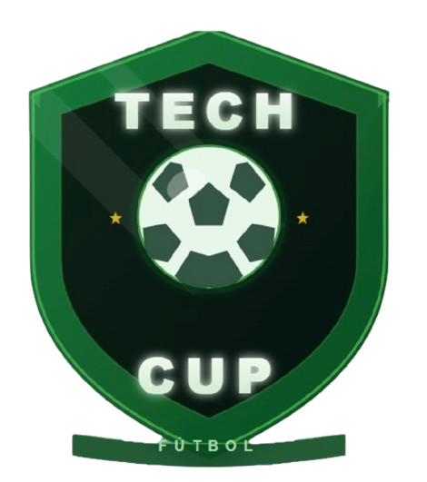
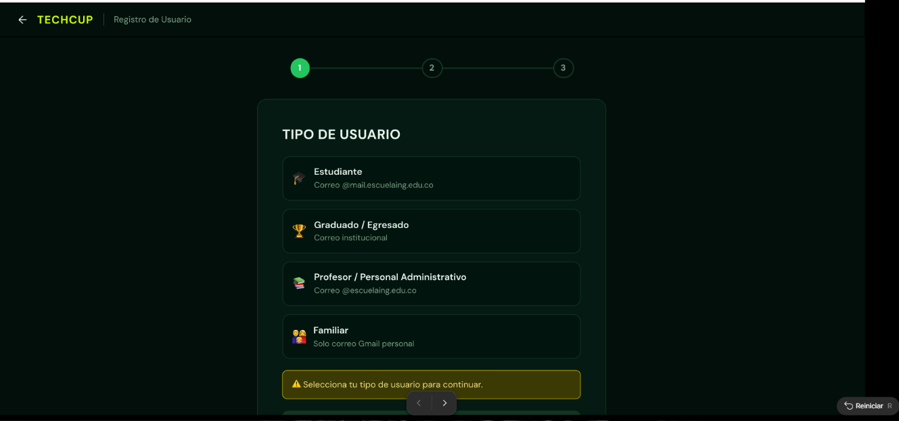
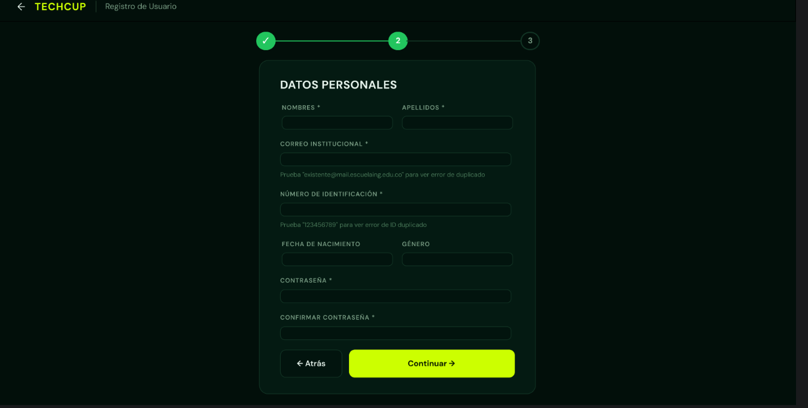
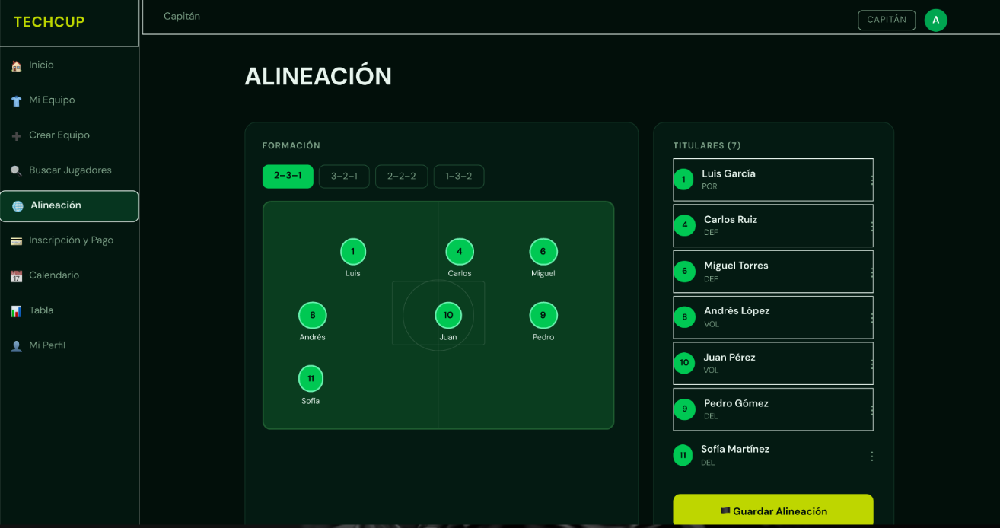
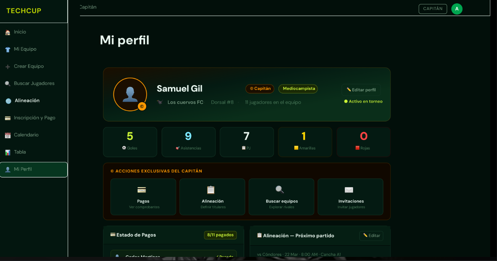
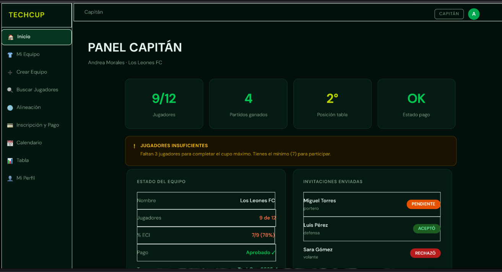

# Manual de Identidad — TechCup Fútbol

## 1. Nombre oficial y slogan

**Nombre:** TechCup Fútbol  
=======
**Slogan:** *"Tu próximo sprint empieza en la cancha."*

---

## 2. Público Objetivo

### Público Objetivo Primario

**Personas objetivo:**

- Estudiantes de los programas de Ingeniería de Sistemas.
- Estudiantes de Ingeniería de Inteligencia Artificial.
- Estudiantes de Ingeniería de Ciberseguridad.
- Estudiantes de Ingeniería Estadística.

**¿Por qué?:**  
Son los principales participantes del torneo semestral de fútbol y quienes utilizarán con mayor frecuencia la plataforma para registrarse como jugadores, unirse o crear equipos, organizar alineaciones y consultar la información del torneo.

**Características:**

- **Edad:** 18 – 28 años
- **Perfil:** Estudiantes universitarios activos de los programas de ingeniería.
- **Nivel tecnológico:** Medio – alto.
- **Intereses:** Fútbol, competencias deportivas universitarias, actividades del campus.
- **Rol en la plataforma:** Jugador o capitán de equipo.

---

### Público Objetivo Secundario

**Personas objetivo:**

- Graduados de los programas de ingeniería de la Escuela Colombiana de Ingeniería.
- Profesores de los programas académicos que participan en el torneo.
- Personal administrativo de la institución.
- Familiares o acompañantes de estudiantes que participan como jugadores.
- Árbitros encargados de dirigir los partidos.
- Organizadores del torneo responsables de su gestión.

**¿Por qué?:**  
Estas personas interactúan con la plataforma para participar en el torneo, consultar información de los partidos o apoyar la organización y desarrollo de la competencia.

**Características:**

- **Edad:** 22 – 50 años
- **Nivel tecnológico:** Medio
- **Rol en la plataforma:** Jugador ocasional, árbitro, organizador o administrador.

---

## 3. Paleta de Colores

La identidad visual de **TechCup Fútbol** utiliza una paleta inspirada en la unión entre **fútbol y tecnología**, con un fondo oscuro que evoca un estadio nocturno y colores brillantes similares a **pantallas LED de marcadores deportivos**.

| Muestra | Nombre | Hex | Uso |
|-------|-------|------|------|
| 

 | Verde Sistemas | `#008542` | Primario — navegación, estados activos |
| 

 | Violeta IA | `#6459C4` | Acento — roles especiales, highlights |
| 

 | Lima Ciberseguridad | `#BED600` | CTA — botones de acción principal |
| 

 | Verde Estadística | `#00D900` | Éxito — estados positivos |
| 

 | Fondo principal | `#0A0F0D` | Fondo principal de la interfaz |
| 

 | Fondo tarjeta | `#111A14` | Fondo de tarjetas |
| 

 | Borde | `#1E3024` | Bordes y separadores |
| 

 | Texto | `#E8F5EE` | Texto sobre fondo oscuro |

---

## 4. Tipografía

La identidad tipográfica de TechCup combina una fuente **impactante para títulos** con una fuente **limpia para interfaz**, permitiendo una comunicación clara entre **deporte y tecnología**.

### Tipografía Display

**Bebas Neue**

Fuente utilizada para **títulos principales, marcadores y elementos de alto impacto visual**.

**Usos:**

- Títulos principales
- Marcadores de partidos
- Encabezados de secciones
- Nombres destacados de equipos

---

### Tipografía de Interfaz

**DM Sans**

Fuente principal utilizada en la **interfaz, textos y componentes del sistema**.

| Peso | Uso |
|-----|-----|
| **Bold** | Etiquetas y botones |
| **SemiBold** | Subtítulos |
| **Regular** | Texto principal |
| **Light** | Texto auxiliar |

---

## 5. Principios de Diseño

### Equilibrio

Uso de **grids de 2 a 4 columnas** que organizan el contenido de manera clara.  
Un **sidebar fijo** permite equilibrar la navegación con el contenido principal.  
Las tarjetas mantienen un peso visual uniforme para distribuir la información de forma ordenada.

---

### Contraste

El fondo oscuro `#0A0F0D` combinado con el color lima `#BED600` genera una relación de contraste **superior a 7:1**, cumpliendo con los estándares de accesibilidad **WCAG AAA**.

Esto permite que los **botones CTA destaquen sobre cualquier superficie** dentro del sistema.

---

### Jerarquía

El sistema tipográfico establece **5 niveles de lectura**:

- **Bebas Neue 40px** — Títulos principales
- **DM Sans 18px** — Subtítulos
- **DM Sans 14px** — Texto principal
- **DM Sans 12px** — Labels
- **DM Sans 11px** — Metadatos

Estos tamaños guían la atención del usuario de forma natural dentro de la interfaz.

---

### Armonía

Los **cuatro colores institucionales** se integran sobre un fondo oscuro para mantener coherencia visual.

Todos los colores tienen variantes con **22% de opacidad** que permiten crear:

- fondos de badges
- tarjetas
- indicadores visuales

El **verde actúa como hilo conductor de la experiencia visual**.

---

## 6. Componentes

| Recurso | Link |
|------|------|
| Mockups Figma | https://www.figma.com/design/jhj4eMbBLkSZvuz9xRVqxw |
| DM Sans | https://fonts.google.com/specimen/DM+Sans |
| DM Mono | https://fonts.google.com/specimen/DM+Mono |
| Repositorio Frontend | techcupfrontend |
| Repositorio Backend | techcup-backend |

### Botones

Primario (CTA)

Secundario

Ghost

Peligro

Éxito

Acento

Deshabilitado

---

### Estados / Badges

APROBADO

PENDIENTE

EN REVISIÓN

RECHAZADO

ACTIVO

INACTIVO

---

### Alertas

<strong style="color:#00D900;">✔ ÉXITO</strong> 
Operación completada correctamente.

<strong style="color:#FF3C3C;">✖ ERROR</strong> 
No se pudo completar la operación.

<strong style="color:#FFC800;">⚠ ADVERTENCIA</strong> 
Acción con consecuencias importantes.

<strong style="color:#6459C4;">ℹ INFORMACIÓN</strong> 
Dato relevante para el usuario.

---

## 7. Concepto Creativo

### “Estadio Nocturno de Alta Tecnología”

El concepto visual de TechCup se inspira en la atmósfera de **un estadio de fútbol durante la noche**, donde el fondo oscuro representa el entorno del estadio y los colores brillantes evocan **pantallas LED y marcadores electrónicos**.

### Pilares del concepto

**Fútbol + Tecnología**  
El deporte y el software se integran como un mismo lenguaje visual.

**Inclusivo**  
La plataforma está pensada para toda la comunidad de la Escuela Colombiana de Ingeniería.

**Profesional**  
La experiencia visual transmite un nivel competitivo y tecnológico acorde a un torneo universitario moderno.

---

## 8. Elementos Visuales de Diseño

---

## 9. Imágenes Utilizadas

!

